# ChatApp

A real-time chat application built with Go. Supports WebSocket messaging, JWT authentication, room management, direct messages, and PostgreSQL persistence.

---

## Screenshots

The following screenshots highlight the main features of ChatApp, including authentication, real-time messaging, direct messaging, and user profile management.

### Login

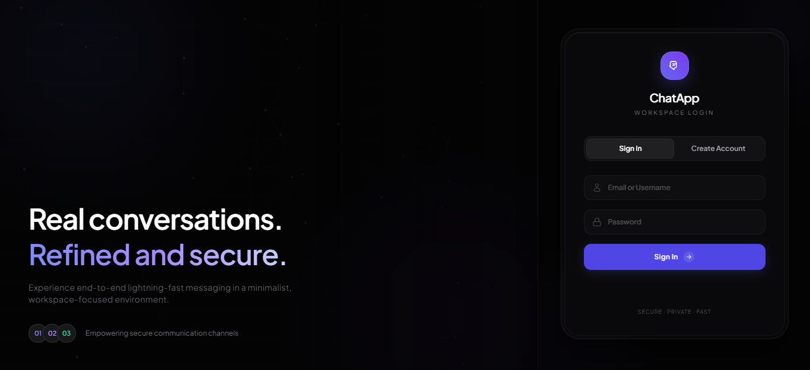

The login page provides a secure authentication system using JWT. Users can sign in using their registered email and password. After successful authentication, a JWT access token is generated and used to authorize subsequent REST API and WebSocket requests. New users can also register from this page.

---

### Dashboard

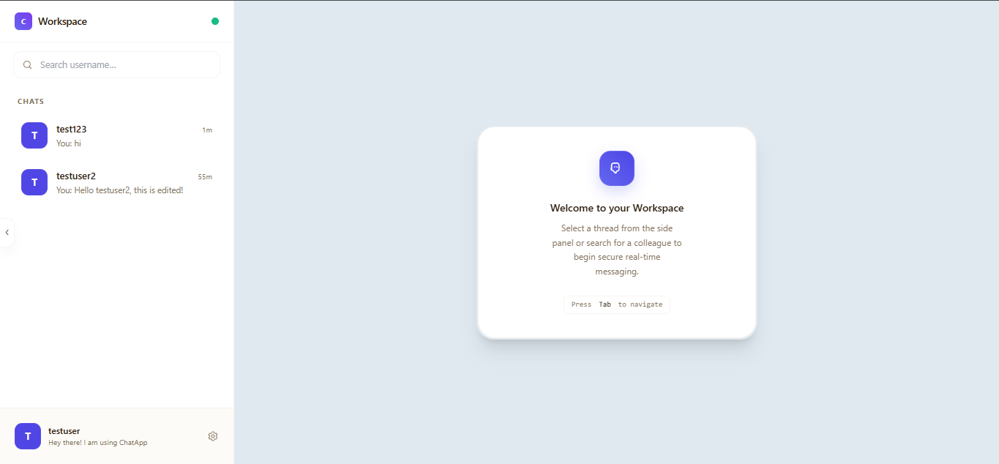

The main interface for public and private room conversations. Users can browse available chat rooms, join discussions, send and receive messages in real time via WebSocket, view message history, monitor online user presence, and see typing indicators.

---

### Direct Message Dashboard

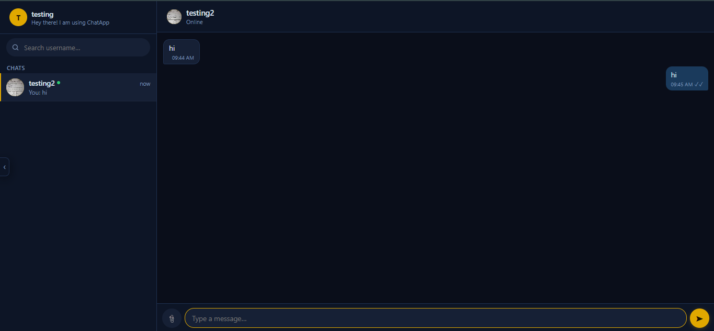

The direct message dashboard enables private one-on-one conversations between users. A dedicated DM room is automatically created for each unique user pair. Users can exchange messages in real time, view conversation history, reply to previous messages, and receive typing status updates.

---

### Settings

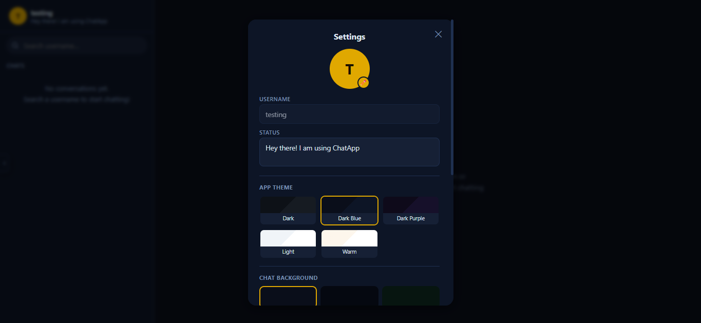

The settings page lets users manage their profile, update their status, change their username or email, and configure application preferences such as themes and chat backgrounds.

---

## Architecture

ChatApp follows a clean layered architecture. Each layer only depends on the layer below it, and all cross-layer contracts are defined as interfaces in the domain package.

```
HTTP / WebSocket request
        │
        ▼
   Middleware
  (auth, rate limit, logger, CORS)
        │
        ▼
    Handler
  (parses request, calls service)
        │
        ▼
    Service
  (business logic, validation)
        │
        ▼
   Repository
  (data access, GORM queries)
        │
        ▼
   PostgreSQL
```

**Package responsibilities:**

| Package              | Responsibility                                                  |
|----------------------|-----------------------------------------------------------------|
| `cmd/`               | Entry point, dependency wiring, graceful shutdown               |
| `internal/domain/`   | Entities, DTOs, repository interfaces (no external deps)        |
| `internal/database/` | DB connection and auto-migration                                 |
| `internal/repository/` | GORM implementations of domain interfaces                    |
| `internal/service/`  | Business logic: auth, rooms, messages, DMs                      |
| `internal/handler/`  | HTTP handlers: parse request, call service, write response     |
| `internal/middleware/` | JWT auth, CORS, rate limiting, request logger, recovery       |
| `internal/websocket/` | WebSocket upgrade, first-message auth, hub, event routing     |
| `internal/router/`   | Route registration and middleware chain                         |

---

## Request & Auth Flow

### REST request

```
Client
  │  POST /api/v1/rooms  +  Authorization: Bearer <jwt>
  ▼
RequestID middleware    → assigns X-Request-ID
  ▼
Logger middleware       → logs method, path, latency, status
  ▼
CORS middleware         → checks Origin against ALLOWED_ORIGINS
  ▼
AuthMiddleware          → parses JWT, checks blacklist (token_blacklists table)
  ▼
RateLimiter            → token-bucket per IP
  ▼
Handler                → validates input, calls RoomService
  ▼
RoomService            → business rules, calls RoomRepository
  ▼
RoomRepository         → GORM query to PostgreSQL
  ▼
Response               → JSON back to client
```

### WebSocket connection & auth

```
Client
  │  GET /api/v1/ws  (no token in URL)
  ▼
WSAuthMiddleware       → checks Authorization header
                         if absent → sets ws_pending_auth = true
  ▼
WS Handler             → upgrades to WebSocket
  │
  ├── if ws_pending_auth:
  │     server sends:  {"type":"auth_required"}
  │     client sends:  {"type":"auth","payload":{"token":"<jwt>"}}
  │     server validates JWT + blacklist check
  │
  └── if Authorization header was valid:
        user identity already set, skip first-message auth
  │
  ▼
Client registered in Hub
Auto-joined to all rooms user is a member of
  │
  ▼
readPump loop          → routes incoming events (send_message, join_room, typing …)
WritePump loop         → drains send channel, sends pings every 30 s
```

### Token revocation (logout)

```
POST /api/v1/auth/logout
  │
  ▼
AuthMiddleware         → extracts JTI from claims, sets token_jti in context
  ▼
AuthHandler            → calls AuthService.Logout(jti, expiresAt)
  ▼
TokenBlacklistRepository → INSERT INTO token_blacklists (jti, expires_at)
  │
  ▼
All future requests with this JTI:
  AuthMiddleware checks → SELECT count(*) FROM token_blacklists WHERE jti = ?
  count > 0  →  401 Token has been revoked
```

---

## Project Structure

```
chatapp/
├── cmd/
│   └── main.go                    # Entry point, dependency injection, graceful shutdown
├── internal/
│   ├── domain/
│   │   ├── models.go              # Entities: User, Room, Message, DTOs
│   │   └── repository.go          # Repository interfaces
│   ├── database/
│   │   └── postgres.go            # DB connection and auto-migration
│   ├── repository/
│   │   ├── user_repository.go
│   │   ├── room_repository.go
│   │   ├── message_repository.go
│   │   └── token_blacklist_repository.go
│   ├── service/
│   │   ├── auth_service.go
│   │   ├── room_service.go
│   │   ├── message_service.go
│   │   └── dm_service.go
│   ├── handler/
│   │   ├── handlers.go            # HTTP handlers (REST API)
│   │   ├── dm_handler.go
│   │   └── upload_handler.go
│   ├── middleware/
│   │   ├── auth.go                # JWT validation + blacklist check
│   │   ├── rate_limiter.go        # Token-bucket rate limiting
│   │   ├── logger.go              # Request ID, logger, recovery
│   │   └── validation.go          # Input validation helpers
│   ├── logger/
│   │   └── logger.go              # zerolog setup
│   ├── websocket/
│   │   ├── hub.go                 # Connection manager and broadcaster
│   │   └── handler.go             # WebSocket upgrade and event routing
│   └── router/
│       └── router.go              # Route definitions and middleware chain
├── static/
│   └── index.html                 # Browser client
├── docs/
│   └── screenshots/
├── docker-compose.yml
├── Dockerfile
└── Makefile
```

---

## Tech Stack

| Layer       | Technology              |
|-------------|-------------------------|
| Framework   | Gin                     |
| WebSocket   | gorilla/websocket       |
| ORM         | GORM                    |
| Database    | PostgreSQL              |
| Auth        | JWT (golang-jwt/jwt v5) |
| Password    | bcrypt                  |
| UUID        | google/uuid             |
| Logging     | zerolog                 |

---

## Quick Start

**1. Clone and configure environment**
```bash
cp .env.example .env
# Fill in DB credentials and JWT secret
go mod tidy
```

**2. Start PostgreSQL**
```bash
make docker-up
```

**3. Run the server**
```bash
make run
```

Server runs at `http://localhost:8080`.

---

## REST API

### Auth

| Method | Endpoint                    | Description              | Auth |
|--------|-----------------------------|--------------------------|------|
| POST   | /api/v1/auth/register       | Register new user        | No   |
| POST   | /api/v1/auth/login          | Login                    | No   |
| GET    | /api/v1/auth/me             | Get current user profile | Yes  |
| PATCH  | /api/v1/auth/me             | Update profile / avatar  | Yes  |
| POST   | /api/v1/auth/logout         | Logout (revoke token)    | Yes  |
| PATCH  | /api/v1/auth/username       | Change username          | Yes  |
| PATCH  | /api/v1/auth/email          | Change email             | Yes  |
| PATCH  | /api/v1/auth/password       | Change password          | Yes  |

### Users

| Method | Endpoint               | Description              | Auth |
|--------|------------------------|--------------------------|------|
| GET    | /api/v1/users/search   | Search users by username | Yes  |
| GET    | /api/v1/users/:id      | Get user by ID           | Yes  |

### Rooms

| Method | Endpoint                       | Description          | Auth |
|--------|--------------------------------|----------------------|------|
| GET    | /api/v1/rooms                  | List public rooms    | Yes  |
| POST   | /api/v1/rooms                  | Create room          | Yes  |
| GET    | /api/v1/rooms/me               | My joined rooms      | Yes  |
| GET    | /api/v1/rooms/:id              | Get room detail      | Yes  |
| DELETE | /api/v1/rooms/:id              | Delete room          | Yes  |
| POST   | /api/v1/rooms/:id/join         | Join room            | Yes  |
| POST   | /api/v1/rooms/:id/leave        | Leave room           | Yes  |
| GET    | /api/v1/rooms/:id/messages     | Get message history  | Yes  |
| POST   | /api/v1/rooms/:id/read         | Mark messages read   | Yes  |

### Messages

| Method | Endpoint               | Description    | Auth |
|--------|------------------------|----------------|------|
| PATCH  | /api/v1/messages/:id   | Edit message   | Yes  |
| DELETE | /api/v1/messages/:id   | Delete message | Yes  |

### Direct Messages

| Method | Endpoint    | Description                                        | Auth |
|--------|-------------|----------------------------------------------------|------|
| GET    | /api/v1/dm  | List my DM conversations                           | Yes  |
| POST   | /api/v1/dm  | Get or create DM room `{"recipient_id":"uuid"}`    | Yes  |

### Upload

| Method | Endpoint         | Description                          | Auth |
|--------|------------------|--------------------------------------|------|
| POST   | /api/v1/upload   | Upload image, file, or audio (≤4 MB) | Yes  |

---

## WebSocket Protocol

**Endpoint:**
```
ws://localhost:8080/api/v1/ws
```

Token authentication is done after the upgrade, never in the URL. Query-param tokens are written to server logs, browser history, and Referer headers.

**Two supported auth flows:**

Option A: Authorization header (API / non-browser clients):
```
GET /api/v1/ws
Authorization: Bearer <jwt>
```

Option B: First-message auth (browser clients):
```
1. Connect: ws://localhost:8080/api/v1/ws
2. Server sends:  {"type":"auth_required"}
3. Client sends:  {"type":"auth","payload":{"token":"<jwt>"}}
4. Auth validated, connection proceeds
```

**Client → server events:**

| Event          | Payload fields                                        |
|----------------|-------------------------------------------------------|
| `auth`         | `token`                                               |
| `join_room`    | `room_id`                                             |
| `leave_room`   | `room_id`                                             |
| `send_message` | `room_id`, `content`, `type`, `reply_to_id` (opt)    |
| `typing`       | `room_id`                                             |
| `stop_typing`  | `room_id`                                             |
| `ping`         | (none)                                                     |

**Server → client events:**

| Event             | Description                    |
|-------------------|--------------------------------|
| `auth_required`   | Server requests first-msg auth |
| `new_message`     | New message in a room          |
| `edit_message`    | Message was edited             |
| `delete_message`  | Message was deleted            |
| `user_joined`     | User joined the room           |
| `user_left`       | User left the room             |
| `user_online`     | User came online               |
| `user_offline`    | User went offline              |
| `typing`          | User is typing                 |
| `stop_typing`     | User stopped typing            |
| `messages_read`   | Partner read your messages     |
| `dm_created`      | A new DM conversation started  |
| `error`           | Error occurred                 |
| `pong`            | Heartbeat response             |

---

## Edit and Delete Rules

Messages can only be edited or deleted if both conditions are met:

1. The message was sent less than 3 minutes ago.
2. The recipient has not yet read it (no blue double-tick).

This is enforced on the frontend. The 3-minute window applies regardless of read status.

---

## Features

- Real-time messaging via WebSocket
- Room-based chat: public, private, and direct message rooms
- Direct messages: 1-on-1 conversations with auto-created room per pair
- JWT authentication with 7-day token expiry
- JWT revocation via token blacklist, logout immediately invalidates the token
- Online presence tracking in real time
- Typing indicators per room
- Paginated message history via REST API
- Edit and soft-delete messages (within rules above)
- Reply to messages for threaded conversations
- File, image, and audio upload (validated by extension and magic-bytes MIME)
- WebSocket first-message auth, token never appears in URL or logs
- CORS and WebSocket origins restricted to `ALLOWED_ORIGINS` env variable
- Token-bucket rate limiting per IP
- Structured logging with zerolog
- Graceful shutdown on SIGINT/SIGTERM (10 s drain)
- Clean architecture: domain → repository → service → handler
- Docker Compose setup included

---

## Rate Limiting

| Endpoint group      | Limit                  |
|---------------------|------------------------|
| /api/v1/auth/*      | 10 requests/min per IP |
| All other endpoints | 120 requests/min per IP|

Exceeding the limit returns `429 Too Many Requests`.

---

## Example API Usage

Register:
```bash
curl -X POST http://localhost:8080/api/v1/auth/register \
  -H "Content-Type: application/json" \
  -d '{"username":"budi","email":"budi@example.com","password":"secret123"}'
```

Login:
```bash
curl -X POST http://localhost:8080/api/v1/auth/login \
  -H "Content-Type: application/json" \
  -d '{"email":"budi@example.com","password":"secret123"}'
```

Create a room:
```bash
curl -X POST http://localhost:8080/api/v1/rooms \
  -H "Authorization: Bearer <token>" \
  -H "Content-Type: application/json" \
  -d '{"name":"General","description":"Main chat room","type":"public"}'
```

Get messages:
```bash
curl "http://localhost:8080/api/v1/rooms/<room_id>/messages?page=1&limit=50" \
  -H "Authorization: Bearer <token>"
```

---

## Unit Tests

```bash
make test
# or with coverage
go test ./... -v -cover
```

Tests live in `test/service/` and use `testify/mock` to mock repository interfaces. No database needed.

---

## Browser Client

A ready-to-use browser client is served at:

```
http://localhost:8080/static/index.html
```

---

## API Testing (Postman)

A Postman collection is included at `docs/ChatApp.postman_collection.json`.

**Import steps:**
1. Open Postman → Import → select `ChatApp.postman_collection.json`
2. The collection includes variables (`base_url`, `token`, `room_id`, etc.) that are automatically saved by test scripts as you run requests in order
3. Start from the **Health** folder and work through folders top to bottom

**What is covered:**

| Area              | Tests included                                                       |
|-------------------|----------------------------------------------------------------------|
| Health            | Server up check                                                      |
| Auth              | Register, login, duplicate email, wrong password, get profile, update profile, search users, logout, revoked token, re-login |
| CORS              | Allowed origin returns CORS headers, blocked origin does not         |
| Rooms             | Create, list, get detail, join (user 2), get messages, leave, delete |
| Messages          | Edit and delete (set `message_id` variable before running)           |
| Direct Messages   | Create DM room, list DMs, get DM messages                            |
| Rate limiter      | Hammer login endpoint via Postman Runner to trigger 429              |

**Running the full suite automatically:**

Use the Postman Collection Runner (▶ button next to the collection name). Set iterations to 1 and run all folders in order. Token and ID variables are passed between requests automatically.

---

## Testing Results

### Collection Runner: All Tests Pass

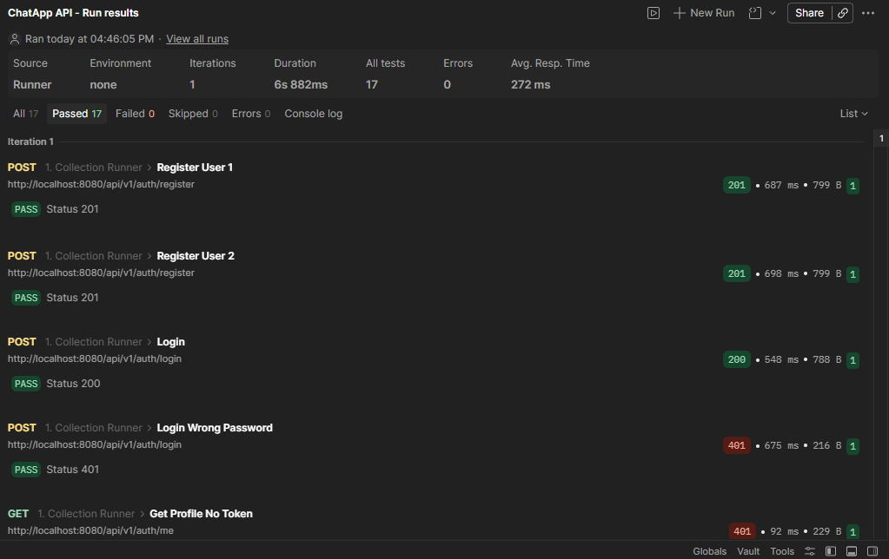

Overview of all 27 requests run via Postman Collection Runner. All assertions passed.

---

### Auth: Register (201 Created)

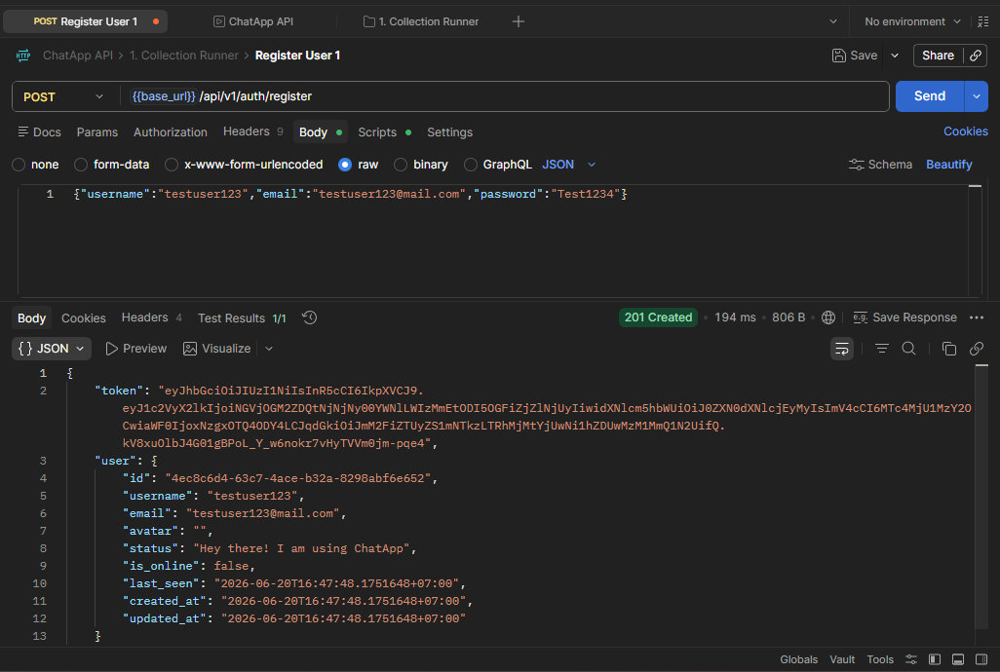

POST `/api/v1/auth/register` registers a new user. Response returns 201 with a JWT token, automatically saved to the `token` collection variable.

---

### Auth: Login (200 OK)

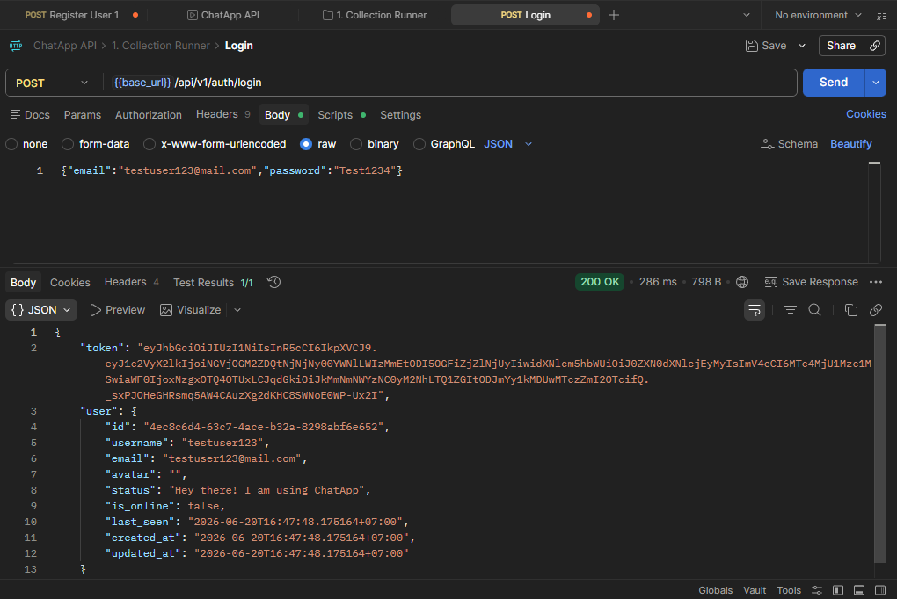

POST `/api/v1/auth/login` authenticates the user and returns a fresh JWT token, which is saved automatically.

---

### Auth: Wrong Password (401 Unauthorized)

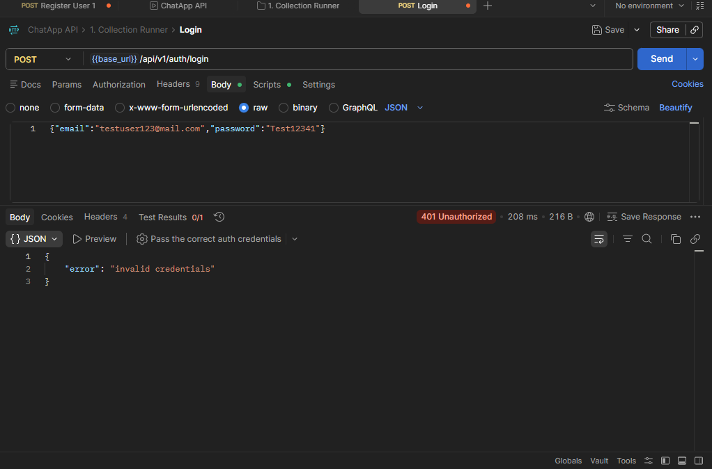

POST `/api/v1/auth/login` with incorrect password. Server returns 401, credentials not accepted.

---

### Auth: Get Profile without Token (401 Unauthorized)

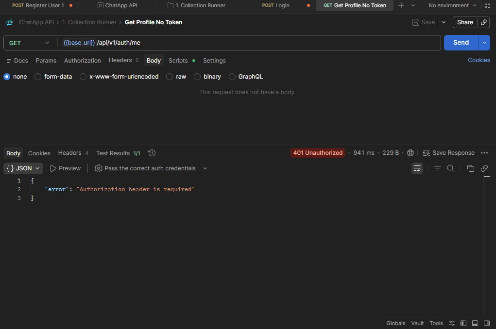

GET `/api/v1/auth/me` without Authorization header. Server returns 401: `Authorization header is required`.

---

### Auth: Logout (200 OK)

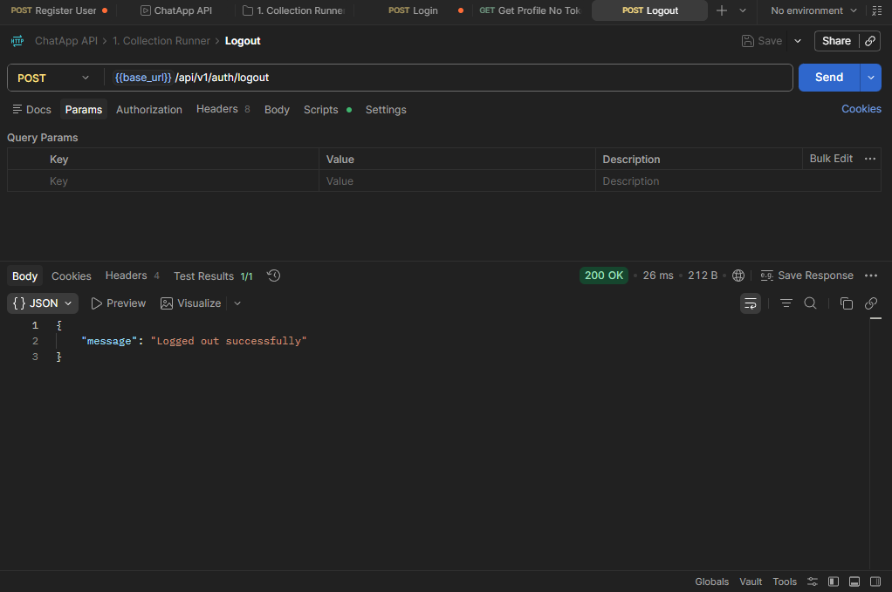

POST `/api/v1/auth/logout` adds the current JWT to the blacklist. Response 200 confirms logout.

---

### Security: Revoked Token (401 Unauthorized)

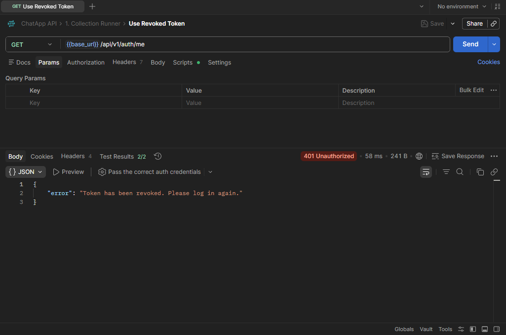

GET `/api/v1/auth/me` using the same token after logout. Server returns 401: `Token has been revoked. Please log in again.` This confirms the JWT blacklist is working correctly.

---

### CORS: Allowed Origin

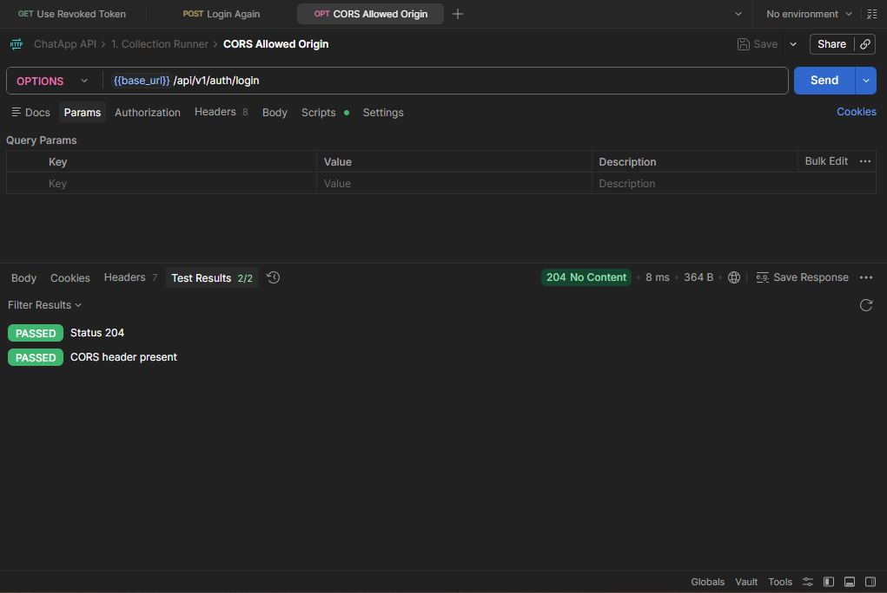

OPTIONS preflight from `http://localhost:3000`. Response includes `Access-Control-Allow-Origin: http://localhost:3000`, confirming the origin is whitelisted.

---

### CORS: Blocked Origin

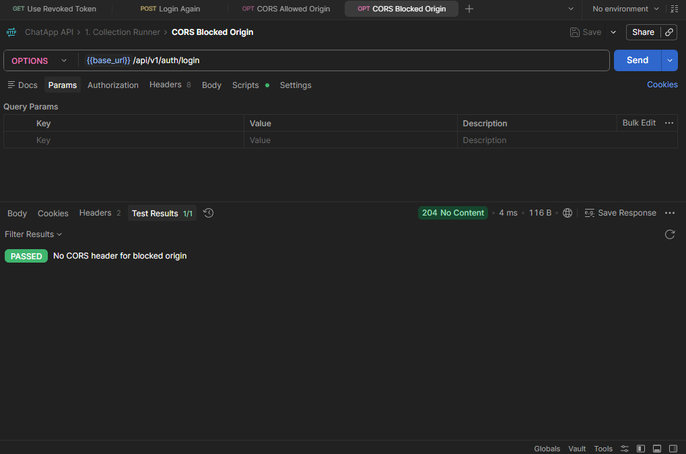

OPTIONS preflight from `https://evil.com`. Response 204 but **no** `Access-Control-Allow-Origin` header. Origin rejected by CORS policy.

---

### Rooms: Create Room (201 Created)

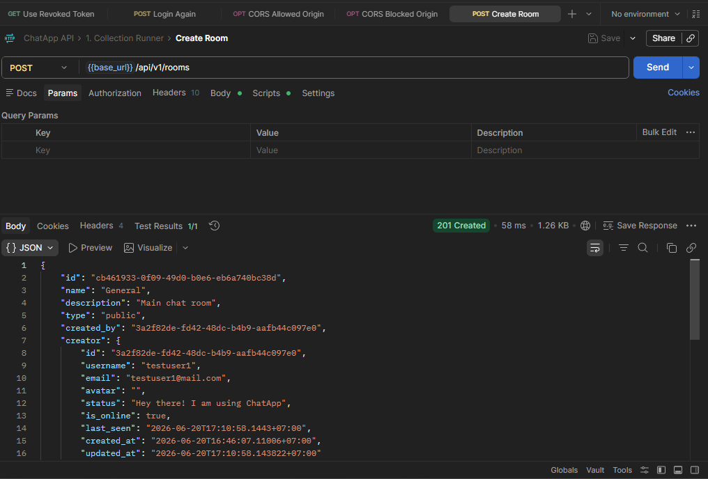

POST `/api/v1/rooms` creates a new public room. Room ID is saved to the `room_id` variable for subsequent requests.

---

### Rooms: Join Room (200 OK)

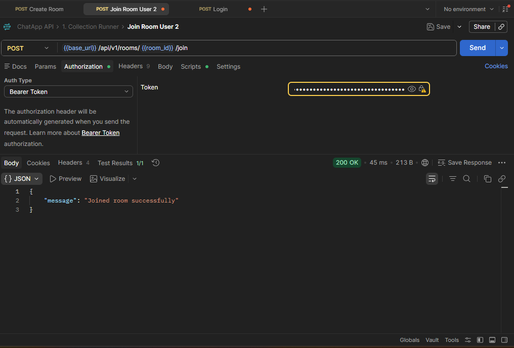

POST `/api/v1/rooms/:id/join` using User 2's token. User 2 successfully joined the room created by User 1.

---

### Rooms: Get Messages (200 OK)

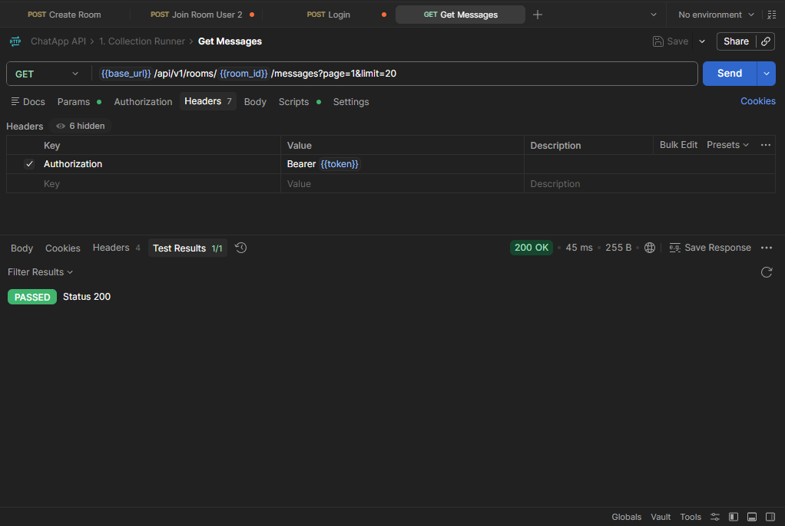

GET `/api/v1/rooms/:id/messages` returns paginated message history with sender details.

---

### Direct Messages: Get DM Messages (200 OK)

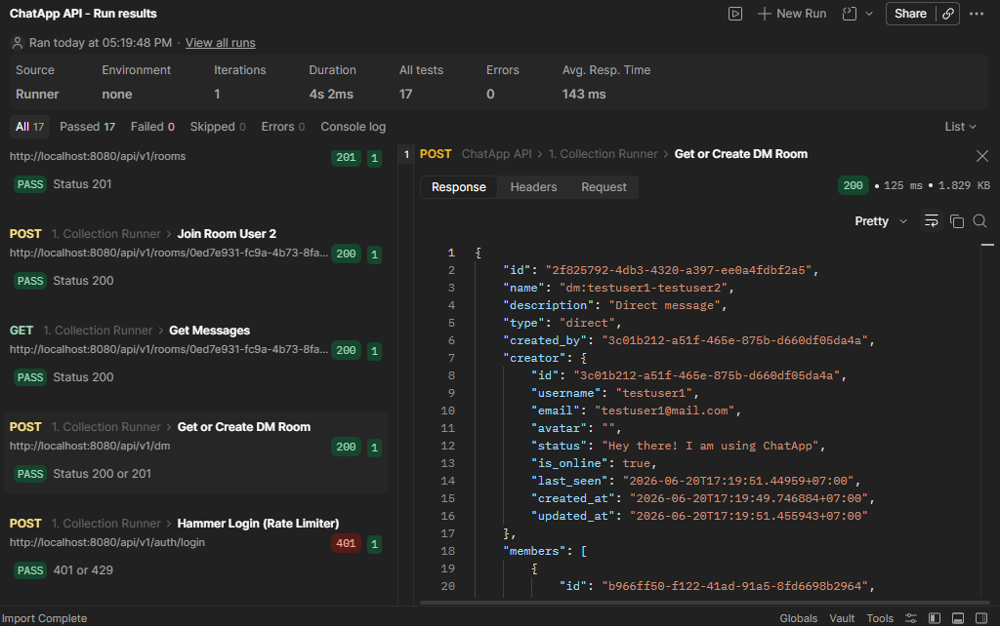

GET `/api/v1/rooms/:dm_room_id/messages` returns the DM conversation history.

---

### Rate Limiter: 429 Too Many Requests

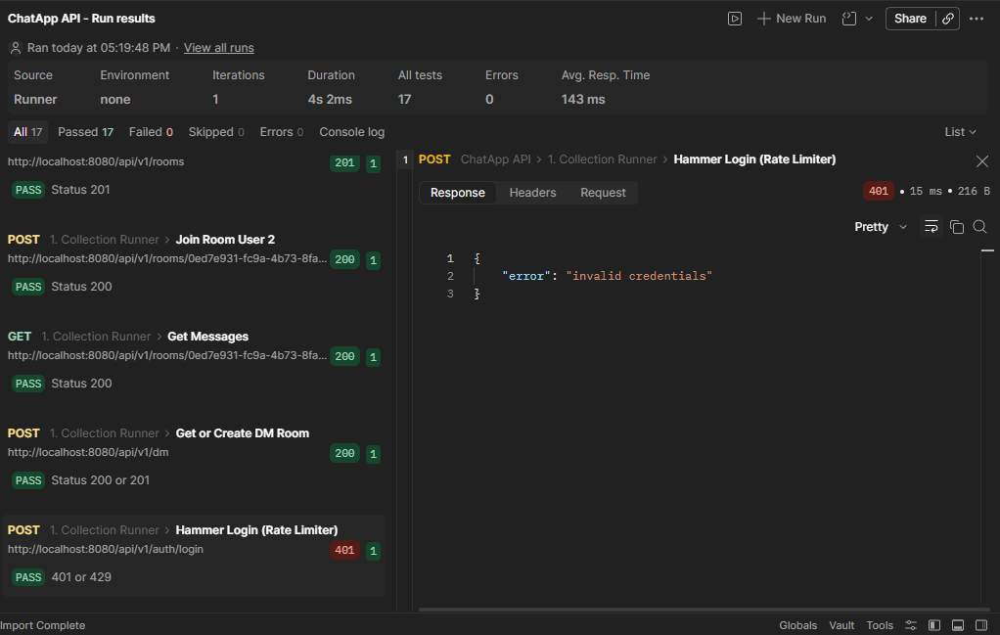

Login endpoint hit 15 times in quick succession via Postman Runner. After ~10 requests the server responds with 429 Too Many Requests, confirming brute force protection is active.
